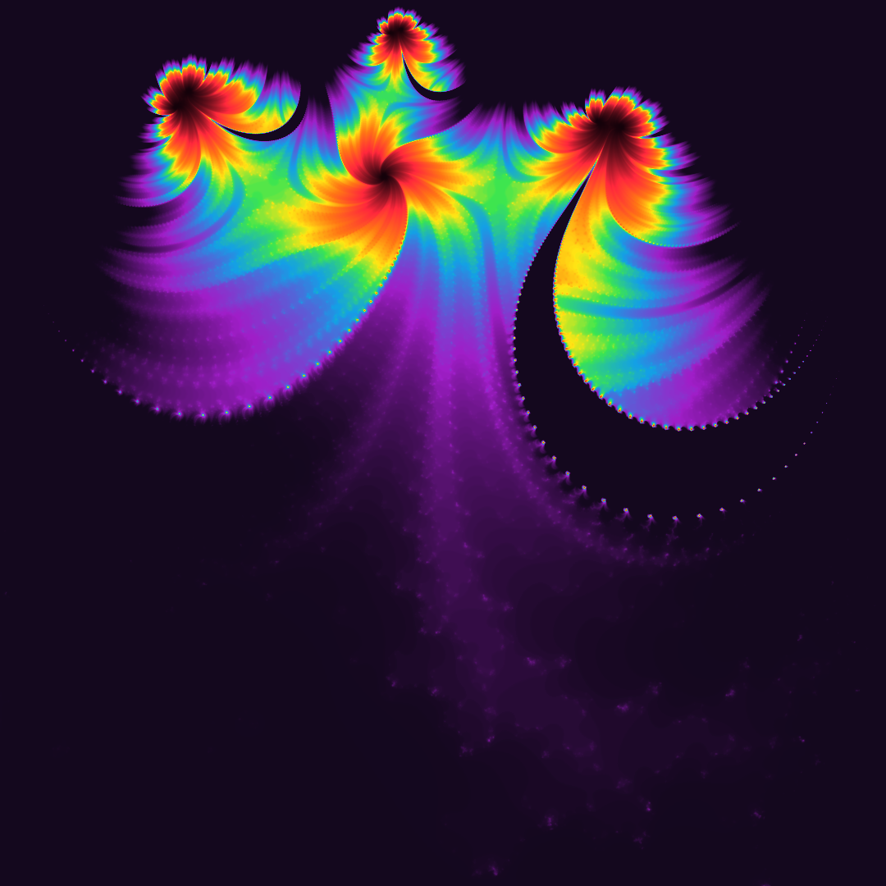
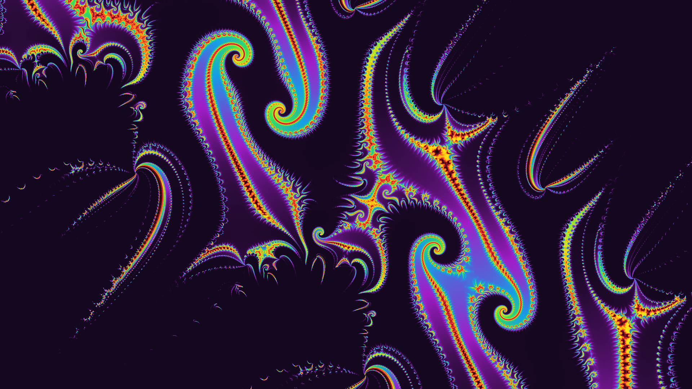
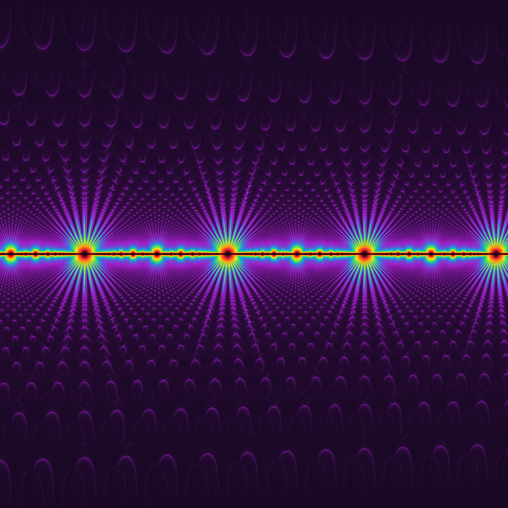
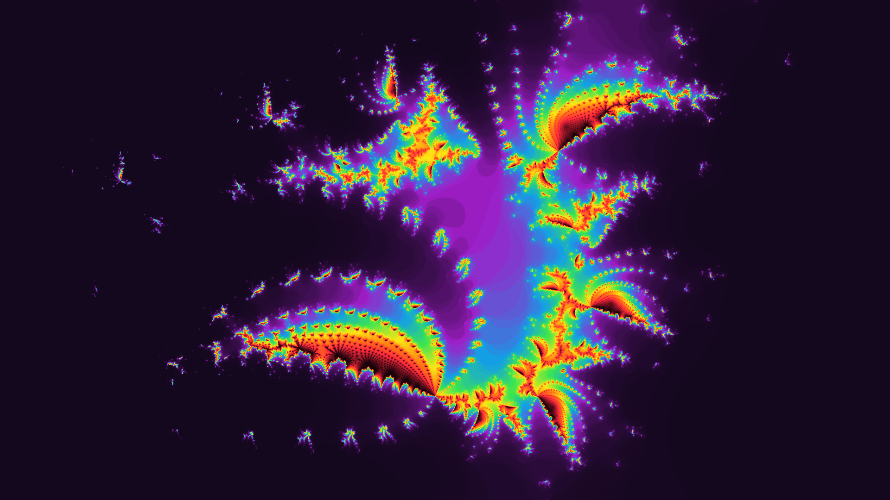

# Fractal Renderer

This is a very simple program used to render fractals to images using a parameter json file.

It includes different fractal kinds among which the Mandelbrot set and a (potentially new) kind of fractal I came up with by using second- and third-degree recursive sequences instead of the classic first-degree recursive pattern used to draw the Mandelbrot set...

### Table of contents

- [Fractal Renderer](#fractal-renderer)
- [How to use](#how-to-use)
- [Preset renders](#preset-renders)
- [Parameter file reference](#parameter-file-reference)
- [Ideas](#ideas)

# How to use

First, download the latest executable from the [releases tab](https://github.com/valflrt/fractal_renderer/releases/latest).

Next, create a json file that with the following structure (see [parameter file reference](#parameter-file-reference)):

```jsonc
{
  "img_width": ...,
  "img_height": ...,
  "zoom": 1.0,
  "center_x": 0.0,
  "center_y": 0.0,
  "max_iter": 80000,
  "sampling": "Medium",
  "fractal": ...,
  "coloring_mode": "CumulativeHistogram"
}
```

Then, in order to render your fractal, run the following command:

```
./fractal_renderer path/to/param_file.json path/to/output_image.png
```

> [!NOTE]
> Supported image formats are png and jpg (extension used to guess image format)

Alternatively, if you have rust installed and downloaded this repository:

```
cargo run -r -- fractal.json fractal.png
```

# Preset renders

These are preset renders I like, you can get their json parameters files by clicking on the title. There are some more in [`presets/`](./presets/).

### [ukhbrp.json](./presets/ukhbrp.json)

> Fractal: `ThirdDegreeRecWithGrowingExponent`



### [ebidxr.json](./presets/ebidxr.json)

> Fractal: `ThirdDegreeRecWithGrowingExponent`


### [mzfyje.json](./presets/mzfyje.json)

> Fractal: `SecondDegreeRecWithGrowingExponent`



### [xvebhd.json](./presets/xvebhd.json)

> Fractal: `SecondDegreeRecWithGrowingExponent`


### [idkzrg.json](./presets/idkzrg.json)

> Fractal: `SecondDegreeRecWithGrowingExponent`



### [dmgtyz.json](./presets/dmgtyz.json)

> Fractal: `SecondDegreeRecAlternating1WithGrowingExponent`



### [datgdv.json](./presets/datgdv.json)

> Fractal: `SecondDegreeRecWithGrowingExponent`


### [dqqbrm.json](./presets/dqqbrm.json)

> Fractal: `ThirdDegreeRecPairs`

I think this one looks a bit like Mandelbrot ?


### [efhhgk.json](./presets/efhhgk.json)

> Fractal: `ThirdDegreeRecPairs`


### [erbeap.json](./presets/erbeap.json)

> Fractal: `ThirdDegreeRecPairs`


# Parameter file reference

- `img_width` _(int)_ and `img_height` _(int)_: Set image width and height.

- `zoom` _(float)_: Set zoom. A smaller number means a deeper zoom.

- `center_x` _(float)_ and `center_y` _(float)_: Set the position of the center of the render area (floats).

  > [!NOTE]
  > This corresponds to coordinates of the center of the render area in the complex plane: `z = center_x + i * center_y`

- `max_iter` _(int)_: Set the maximum iteration count (around 80000 recommended except for mandelbrot-like fractals that look better with ~1000 iterations).

- `fractal_kind`: Set the fractal you want to draw. Available options are:

  - `"Mandelbrot"`
  - `"SecondDegreeRecWithGrowingExponent"`
  - `"SecondDegreeRecAlternating1WithGrowingExponent"`
  - `"ThirdDegreeRecWithGrowingExponent"`
  - `{ "NthDegreeRecWithGrowingExponent": n }`
  - `"ThirdDegreeRecPairs"`

- `coloring_mode` _(optional)_: Set the way pixels are colored. Available options are:

  - `"BlackAndWhite"`: Draws pixels black if the maximum iteration count has been reached, otherwise white.
  - `"Linear"`: Maps the iteration count for a pixel to a value between 0 and 1 by dividing it by the maximum iteration count and uses this value to pick a color from the gradient.
  - `"Squared"`: Similar to `"Linear"`, but the value between 0 and 1 is squared before picking a color from the gradient.
  - `"CumulativeHistogram"` _(default)_: More information [here](https://en.wikipedia.org/wiki/Plotting_algorithms_for_the_Mandelbrot_set#Histogram_coloring).

- `sampling` _(optional)_: Set sampling options.

  - `level` _(optional)_: Set sampling level: higher values take more samples and (hopefully) give a smoother result. Available options are:
    - `"Low"` _(default)_
    - `"Medium"`
    - `"High"`
    - `"Ultra"`
    - `"Extreme"`
    - `"Extreme1"`
    - `"Extreme2"`
    - `"Extreme3"`
  - `random_offsets` _(bool, optional)_: Enable or disable random offsets. They are used to get rid of moiré patterns but they make noise appear on some fractals so it might be useful to disable them.

- `custom_gradient` _(optional)_: Set a custom gradient. This is an array of array of the form `[t, [r, g, b]]` where `t` is a float between 0 and 1 and `r`, `g`, `b` the color at that point in the gradient. Colors in between are interpolated.

  Example:

  ```
  {
    ...
    "custom_gradient": [
      [0.0, [10, 2, 20]],
      [0.1, [200, 40, 230]],
      [0.25, [20, 160, 230]],
      [0.4, [60, 230, 80]],
      [0.55, [255, 230, 20]],
      [0.7, [255, 120, 20]],
      [0.85, [255, 40, 60]],
      [0.95, [2, 0, 4]]
    ]
    ...
  }
  ```

- `dev_options` _(optional)_: For development purposes.
  - `save_sampling_pattern` _(bool, optional)_: Save the sampling pattern as an image.
  - `display_gradient` _(bool, optional)_: Draw the gradient used for coloring in the bottom right corner of the image.

# Ideas

- Add a way to set up a list of "non-render rectangles" in the param file: this would allow marking areas as highly divergent and prevent huge amounts of computation.
- use wgpu to perform calculations ? see [this](https://github.com/gfx-rs/wgpu/blob/trunk/examples%2Fsrc%2Fhello_compute%2Fmod.rs) and especially  [this](https://github.com/gfx-rs/wgpu/blob/trunk/examples%2Fsrc%2Frepeated_compute%2Fmod.rs)