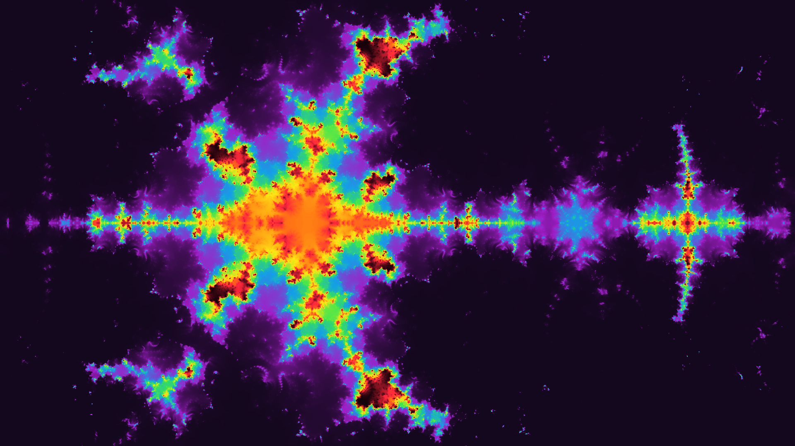
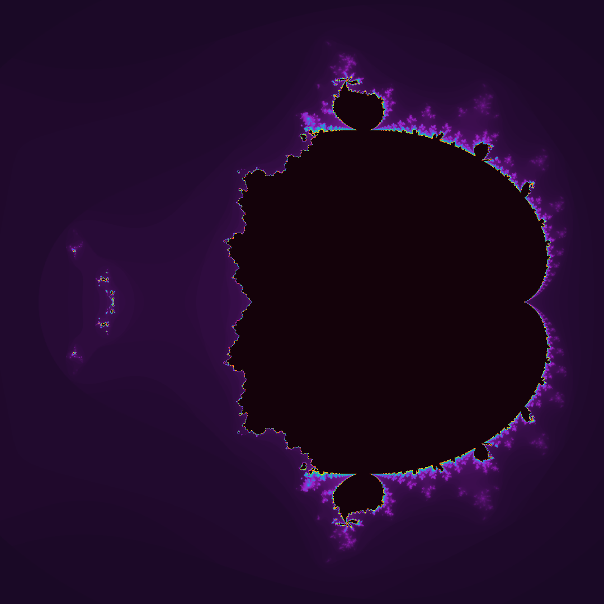
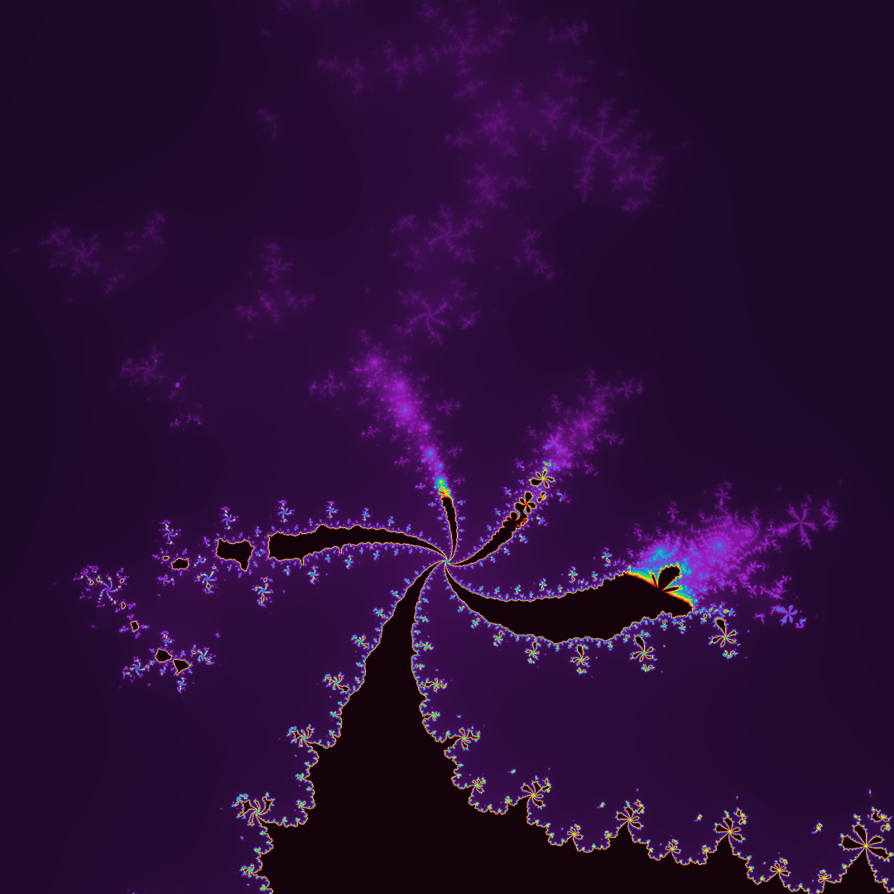

# Fractal Renderer

This is a program used to render fractals to images using a parameter [RON](https://docs.rs/ron/latest/ron/) file.

### Table of contents

- [Fractal Renderer](#fractal-renderer)
- [How to use](#how-to-use)
- [Preset renders](#preset-renders)
- [Parameter file reference](#parameter-file-reference)
- [Ideas](#ideas)
- [Fractal ideas](#fractal-ideas)
- [Notes](#notes)

# How to use

First, download the latest executable from the [releases tab](https://github.com/valflrt/fractal_renderer/releases/latest).

Next, create a RON parameter file that with the following structure (see [parameter file reference](#parameter-file-reference)):

```rust
(
    img_width: 1920,
    img_height: 1080,
    render: Frame(
        zoom: 0.001,
        center_x: 0.0097,
        center_y: -0.01,
        fractal: SecondDegreeRecWithGrowingExponent,
    )
    max_iter: 100000,
    coloring_mode: CumulativeHistogram,
    sampling: (
        level: High,
        random_offsets: true,
    ),
)
```

Then, in order to render your fractal, run the following command:

```
./fractal_renderer path/to/param_file.ron path/to/output_image.png
```

> [!NOTE]
> Supported image formats are png and jpg (extension used to guess image format)

Alternatively, if you have rust installed and downloaded this repository:

```
cargo run -r -- fractal.ron fractal.png
```

# Preset renders

These are preset renders I like, you can get their ron parameters files by clicking on the title. There are some more in [`presets/`](./presets/).

### [ukhbrp.ron](./presets/ukhbrp.ron)

> Fractal: `ThirdDegreeRecWithGrowingExponent`


### [ebidxr.ron](./presets/ebidxr.ron)

> Fractal: `ThirdDegreeRecWithGrowingExponent`



### [mzfyje.ron](./presets/mzfyje.ron)

> Fractal: `SecondDegreeRecWithGrowingExponent`


### [ecwfwb.ron](./presets/ecwfwb.ron)

> Fractal: `SecondDegreeRecWithGrowingExponentParam`

https://github.com/user-attachments/assets/a328b7b6-0e66-490a-9a35-ef8e93178f94

### [xvebhd.ron](./presets/xvebhd.ron)

> Fractal: `SecondDegreeRecWithGrowingExponent`


### [ckvjjj.ron](./presets/ckvjjj.ron)

> Fractal: `SecondDegreeThirtySevenBlend`


### [gqwzzr.ron](./presets/gqwzzr.ron)

> Fractal: `ComplexLogisticMapLike`

https://github.com/user-attachments/assets/83793c10-4d2a-47f2-8e0b-7cee47c27e6b

### [idkzrg.ron](./presets/idkzrg.ron)

> Fractal: `SecondDegreeRecWithGrowingExponent`


### [dmgtyz.ron](./presets/dmgtyz.ron)

> Fractal: `SecondDegreeRecAlternating1WithGrowingExponent`


### [datgdv.ron](./presets/datgdv.ron)

> Fractal: `SecondDegreeRecWithGrowingExponent`


### [dqqbrm.ron](./presets/dqqbrm.ron)

> Fractal: `ThirdDegreeRecPairs`

I think this one looks a bit like Mandelbrot ?



### [efhhgk.ron](./presets/efhhgk.ron)

> Fractal: `ThirdDegreeRecPairs`



### [erbeap.ron](./presets/erbeap.ron)

> Fractal: `ThirdDegreeRecPairs`


# Parameter file reference

- `img_width` _(int)_ and `img_height` _(int)_: Set image width and height.

- `render`: Set render mode and render options. Available values are:

  - `Frame`: Render an image.

    - `zoom` _(float)_: Set zoom. A smaller number means a deeper zoom.

    - `center_x` _(float)_ and `center_y` _(float)_: Set the position of the center of the render area.

      > This corresponds to coordinates of the center of the render area in the complex plane: `z = center_x + i * center_y`

    - `fractal_kind`: Set the fractal you want to draw. Available options are:

      - `Mandelbrot`
      - `MandelbrotCustomExp ( exp: float )`
      - `SecondDegreeRecWithGrowingExponent`
      - `SecondDegreeRecWithGrowingExponentParam ( a_re: float, a_im: float )`
      - `SecondDegreeRecAlternating1WithGrowingExponent`
      - `ThirdDegreeRecWithGrowingExponent`
      - `NthDegreeRecWithGrowingExponent(n)`
      - `ThirdDegreeRecPairs`
      - `SecondDegreeThirtySevenBlend`
      - `ComplexLogisticMapLike ( re: float, im: float )`

  - `Animation`: Render the frames of an animation.

    It uses `RenderStep` to perform transitions between float values. `RenderStep` has three possible options: `Const(start_time, end_time, value)`, `Linear(start_time, end_time, start_value, end_value)` and `Smooth(start_time, end_time, start_value, end_value)`.
    See [gqwzzr.ron](./presets/gqwzzr.ron) for an example.

    - `zoom` _(RenderStep)_: Set zoom. A smaller number means a deeper zoom.

    - `center_x` _(RenderStep)_ and `center_y` _(RenderStep)_: Set the position of the center of the render area.

      > This corresponds to coordinates of the center of the render area in the complex plane: `z = center_x + i * center_y`

    - `fractal_kind`: Set the fractal you want to draw. Available options are:

      - `Mandelbrot`
      - `MandelbrotCustomExp ( exp: RenderStep )`
      - `SecondDegreeRecWithGrowingExponent`
      - `SecondDegreeRecWithGrowingExponentParam ( a_re: RenderStep, a_im: RenderStep )`
      - `SecondDegreeRecAlternating1WithGrowingExponent`
      - `ThirdDegreeRecWithGrowingExponent`
      - `NthDegreeRecWithGrowingExponent(n)`
      - `ThirdDegreeRecPairs`
      - `SecondDegreeThirtySevenBlend`
      - `ComplexLogisticMapLike ( re: RenderStep, im: RenderStep )`

    - `duration` _(float)_: The duration of the animation (in seconds).

    - `fps` _(float)_: The number of frames per second.

- `max_iter` _(int)_: Set the maximum iteration count (around 80000 recommended except for mandelbrot-like fractals that look better with ~1000 iterations).

- `coloring_mode`: Set the way pixels are colored. Available options are:

  - `CumulativeHistogram`: More information [here](https://en.wikipedia.org/wiki/Plotting_algorithms_for_the_Mandelbrot_set#Histogram_coloring).
  - `MaxIterNorm ( map_value )`: Normalizes the value based on the `max_iter` parameter.
  - `MaxNorm ( map_value )`: Normalizes the value based on the highest iteration count reached while sampling.
  - `MinMaxNorm ( map_value )`: Performs min-max normalization using the lowest and the highest iteration counts reached while sampling.
    `CustomMaxNorm ( max, map_value )`: Normalizes the value based on the given max value. Setting this allows getting the visuals obtained with a maximum iteration count of `max` except the actual maximum iteration count is `max_iter`.
  - `CustomMinMaxNorm ( min, max, map_value )`: Performs min-max normalization using the provided `min` and `max` values.
  - `BlackAndWhite`: Draws a pixel black if the maximum iteration count (`max_iter`) has been reached, otherwise white.

  Here, all `map_value` fields must be one of the following options:

  - `Linear`
  - `Squared`
  - `Powf(exp)`

- `sampling`: Set sampling options.

  - `level`: Set sampling level: higher values take more samples and (hopefully) give a smoother result. Available options are:
    - `Exploration`
    - `Low`
    - `Medium`
    - `High`
    - `Ultra`
    - `Extreme`
    - `Extreme1`
    - `Extreme2`
    - `Extreme3`
  - `random_offsets` _(bool)_: Enable or disable random offsets. They are used to get rid of moiré patterns but they make noise appear on some fractals so it might be useful to disable them.

- `custom_gradient` _(optional)_: Set a custom gradient. This is an array of array of the form `[t, [r, g, b]]` where `t` is a float between 0 and 1 and `r`, `g`, `b` the color at that point in the gradient. Colors in between are interpolated.

  Example:

  ```rust
  (
    ..
    custom_gradient: Some([
        (0., (10, 2, 20)),
        (0.1, (200, 40, 230)),
        (0.25, (20, 160, 230)),
        (0.4, (60, 230, 80)),
        (0.55, (255, 230, 20)),
        (0.7, (255, 120, 20)),
        (0.85, (255, 40, 60)),
        (0.95, (2, 0, 4))
    ]),
    ..
  )
  ```

- `diverging_areas` _(optional)_: This allows setting areas where computing pixel values will be skipped assuming they diverge.

  ```rust
  (
    ..
    diverging_areas: Some([
        (min_x, max_x, min_y, max_y),
        ..
    ]),
    ..
  )
  ```

- `dev_options` _(optional)_: For development purposes.
  - `save_sampling_pattern` _(bool)_: Save the sampling pattern as an image.
  - `display_gradient` _(bool)_: Draw the gradient used for coloring in the bottom right corner of the image.

# Ideas

- allow rendering animations by adding frames/transitions settings
- use wgpu to perform calculations ? see [this](https://github.com/gfx-rs/wgpu/blob/trunk/examples%2Fsrc%2Fhello_compute%2Fmod.rs) and especially [this](https://github.com/gfx-rs/wgpu/blob/trunk/examples%2Fsrc%2Frepeated_compute%2Fmod.rs)
- use opencl to perform calculations ? see [this](https://docs.rs/opencl3/latest/opencl3/)

# Fractal ideas

- Do an animation of the fractal defined by `z_n+2 = z_n+1 * (a - z_n)` with a (a complex number) varying over time.

# Notes

- To create a video from the frames:
  ```bash
  ffmpeg -framerate 30 -pattern_type glob -i '_test/*.png' -c:v libx264 -pix_fmt yuv420p _test/out.mp4
  ```
