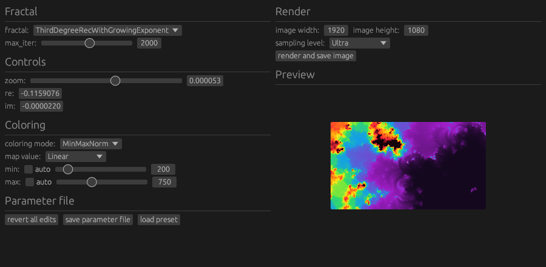

# Fractal Renderer

This is a program used to render fractals using a [RON](https://docs.rs/ron/latest/ron/) parameter file. It also has a very simple gui for an easier navigation.

### Table of contents

- [Fractal Renderer](#fractal-renderer)
- [How to install](#how-to-install)
- [How to use](#how-to-use)

# How to install

If you have cargo installed:

```
cargo install fractal_rdr
```

Otherwise, you can download the latest executable from the [releases tab](https://github.com/valflrt/fractal_rdr/releases/latest).

# How to use

Create a RON parameter file with the following structure (see [parameter file reference](./REFERENCE.md) and [preset renders](#preset-renders)):

```rust
Frame((
    img_width: 1920,
    img_height: 1080,

    zoom: 0.000053,
    center_x: -0.1159076,
    center_y: -0.000022,
    fractal: ThirdDegreeRecWithGrowingExponent,

    max_iter: 2000,

    coloring_mode: MinMaxNorm(
        min: Custom(200),
        max: Custom(750),
        map: Linear,
    ),
    sampling: (
        level: Ultra,
        random_offsets: true,
    ),
))
```

> [!NOTE]
> If the parameter file doesn't exist, it will be created automatically with default values.

Then, either ...

- ... render the fractal:

  ```
  ./fractal_rdr path/to/param_file.ron path/to/output_image.png
  ```

  > Alternatively, if you have rust installed and downloaded this repository:
  >
  > ```
  > cargo run -r -- fractal.ron fractal.png
  > ```

- ... start the gui:

  ```
  ./fractal_rdr path/to/param_file.ron path/to/output_image.png --gui
  ```

  The app looks like this:

  

> [!NOTE]
> Supported image formats are png and jpg (the extension is used to guess the format)
